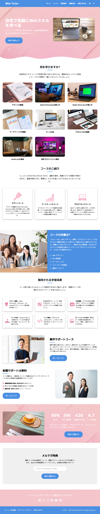

# ポートフォリオサイト

架空のサービスサイトです。トップページとコンタクトページを作りました。

## デモ

[デモサイトのリンク](https://axiaclip-dev.github.io/WebTutor-demo/)

## 技術スタック

- HTML5
- CSS3
- Normalize.css
- Flexbox
- CSS Grid

## スナップショット

### PC 版



## 成果

- 基本的な HTHTML/CSS の正確な記述
- HTML/CSS の正確な記述
- ハンバーガーメニューとアニメーションの記述

## ディレクトリ構成

```bash
service-lp-demo/
|- images/
|- css/
|- index.html
|- .gitignore
|- README.md
```

## インストール

- リポジトリをクローンします。

```bash
git clone https://github.com/axiaclip-dev/WebTutor-demo.git
```

## 著作権

- ソースコード、ロゴ、ファビコンの著作権は Axia Clip にあります。
- デザイン案は別にあり、AxiaClip にてカスタマイズしています。
- Modern HTML & CSS From The Beginning 2.0 (2024 Revamp)コースの、Section18-19 です。

## 画像の著作権

- 画像、デザイン、コードの著作権は Udemy 講師の Brad Traversy さんにあります。
